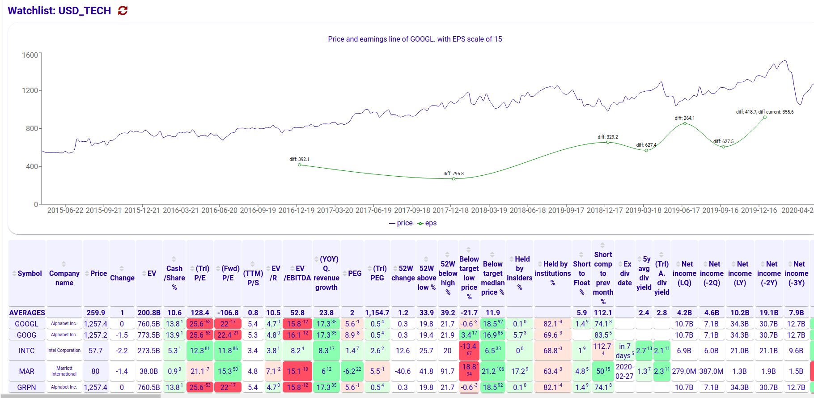

# Stock analyst UI

FE for https://github.com/dusanzahoransky/stock-analyst

The UI provides a convenient view to compare fundamental stock stats for pre-selected stocks, including
 * Trailing/Forward PE
 * EV/EBITDA
 * YOY revenue growth
 * Price compare to target estimate and 52 low and high
 * Income, Revenue, Cash, Inventory, Liabilities and Total liabilities growth
 * Stock holders stats and repurchase
 * EPS and it's growth
 
It also renders a famous Peter Lynch's chart for price and earnings line.

