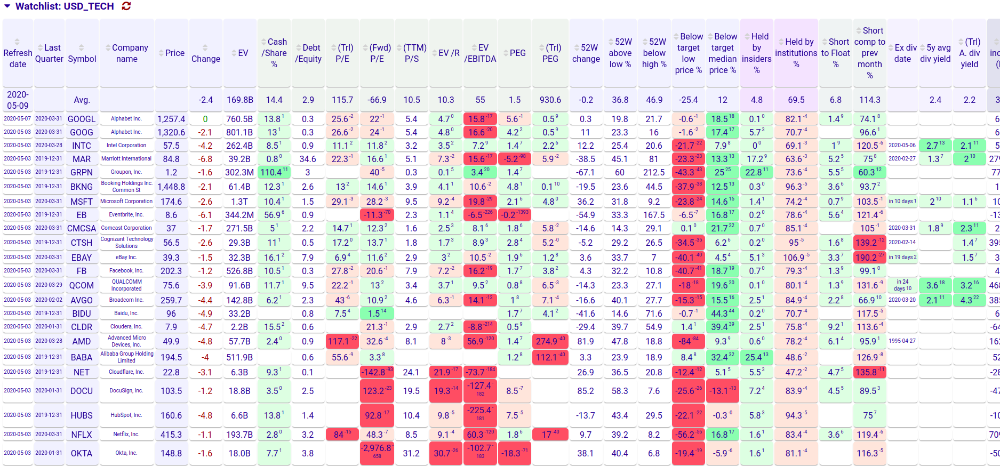
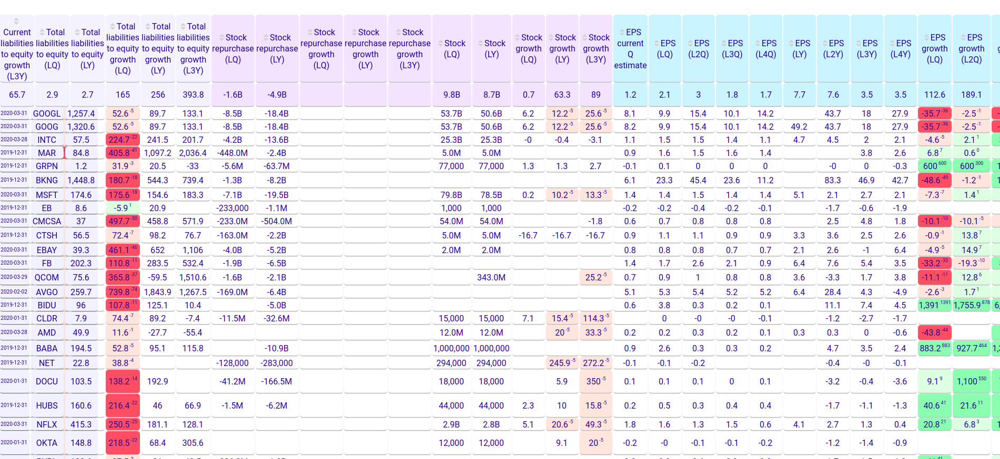
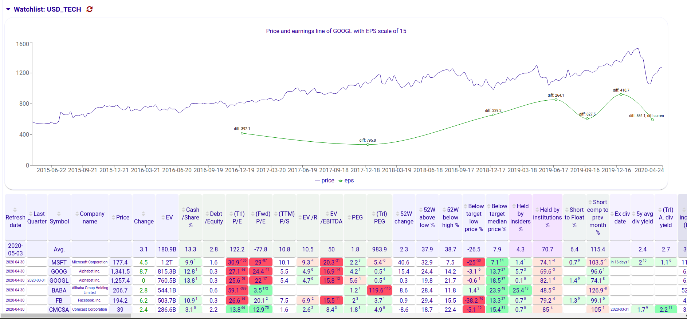
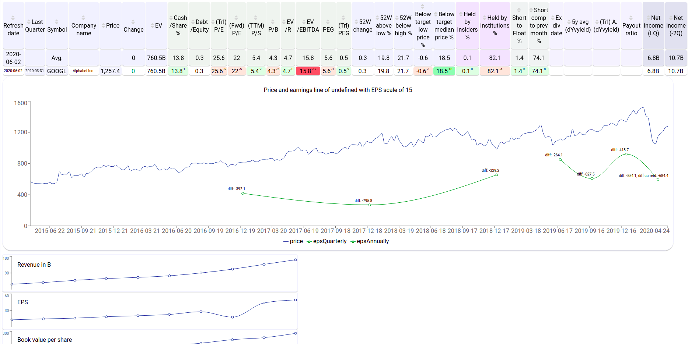
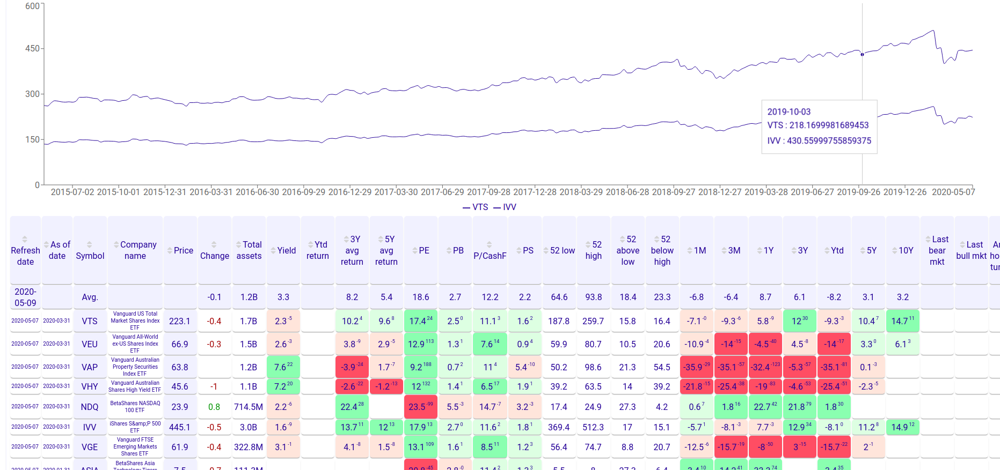

# Stock analyst UI

FE for https://github.com/dusanzahoransky/stock-analyst

The UI provides a convenient view to compare fundamental stock stats for pre-selected stocks, including
 * Trailing/Forward PE
 * EV/EBITDA
 * YOY revenue growth
 * Price compare to target estimate and 52 low and high
 * Income, Revenue, Cash, Inventory, Liabilities and Total liabilities growth
 * Stock holders stats and repurchase
 * EPS and it's growth
 

 
It also renders price and earnings line.

Charts with historical ratios

For indices, it provides basic ratios such as PE, PB, PS, etc. and their performance over different periods. Also, renders a chart for comparison of their historical performance.

