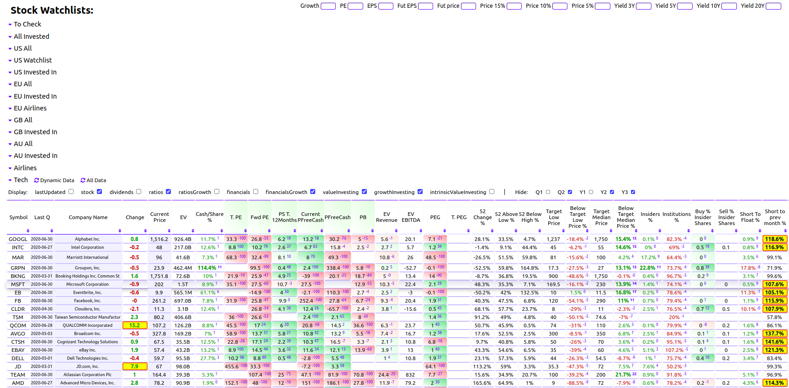
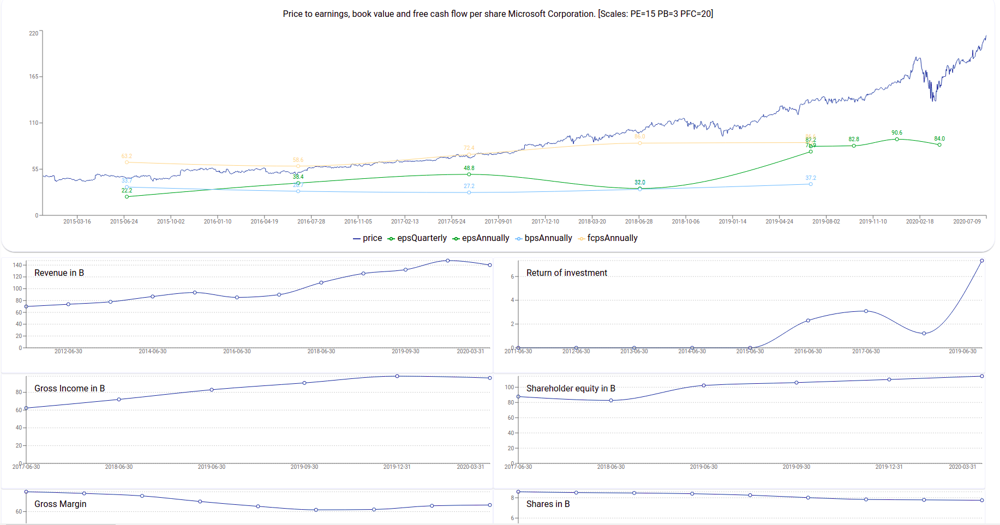
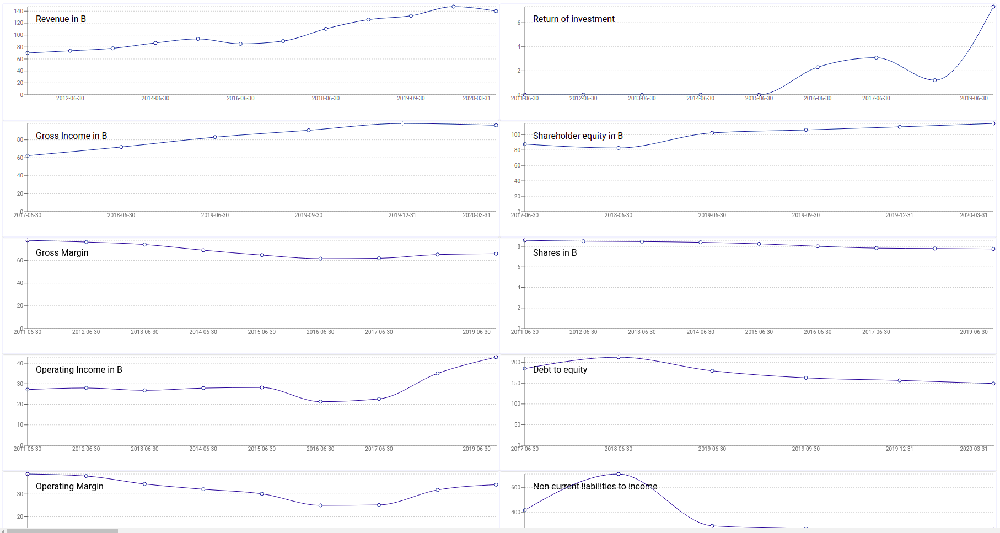
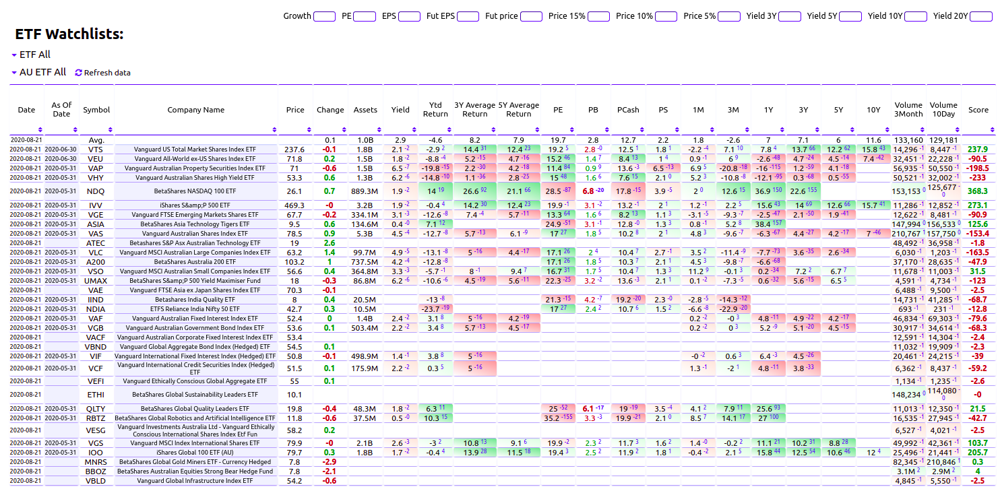

# Stock analyst UI

FE for https://github.com/dusanzahoransky/stock-analyst

The UI provides a convenient view to compare fundamental stock stats for pre-selected stock watchlists, such as:

 * Trailing/Forward PE, PB, EV/EBITDA, ROIC
 * Income, Revenue, Cash, Inventory, Liabilities and Total liabilities growth
 * Gross, Operating and Net Margins
 * Debt to Income and Current ratio
 * Stock holders stats and repurchase
 * Insider transactions
 * EPS and it's growth
 * Price compare to target estimate and 52 low and high and many other
 
These stats and ratios are displayed for the last and one previous financial quarter as well as for the last year, 2 and 3 financial years before. 



It also renders price and EPS timeline at scale of PE 15, BPS at PB scale 3 and free cash flow per share at scale 20.


Convenient charts of some fundamental stats and ratios  


For indices, it provides basic ratios such as PE, PB, PS, etc. and their performance over different periods. Also, renders a chart for comparison of their historical performance.



## Run

```
npm start
```